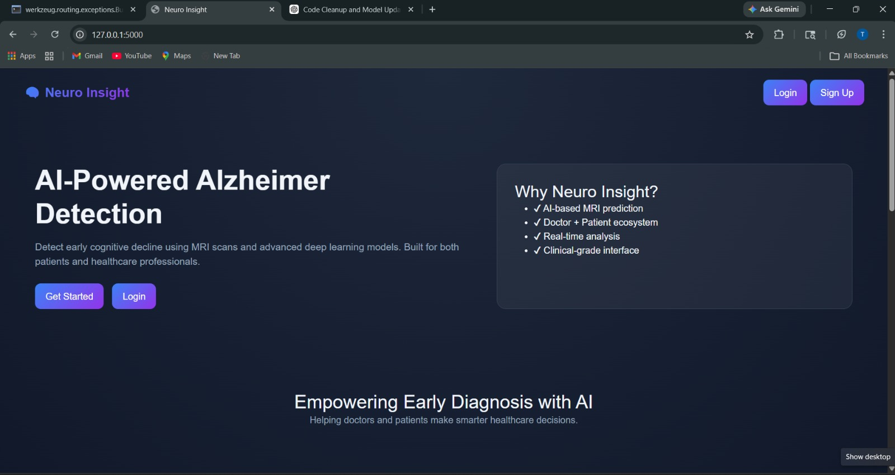
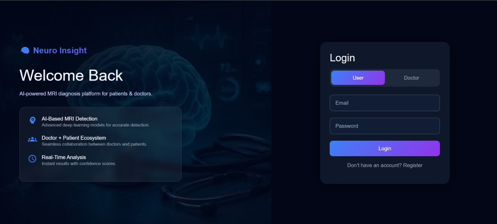
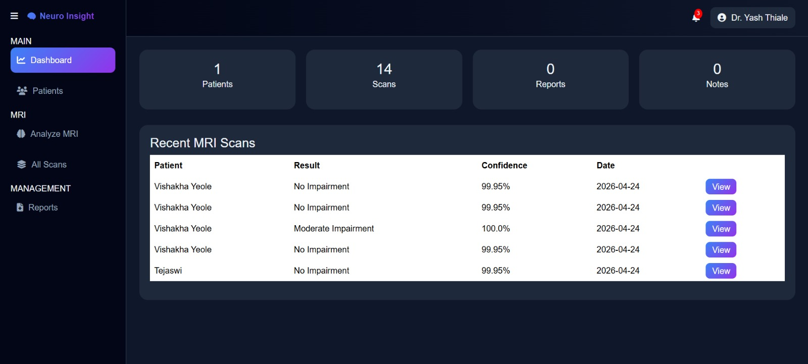
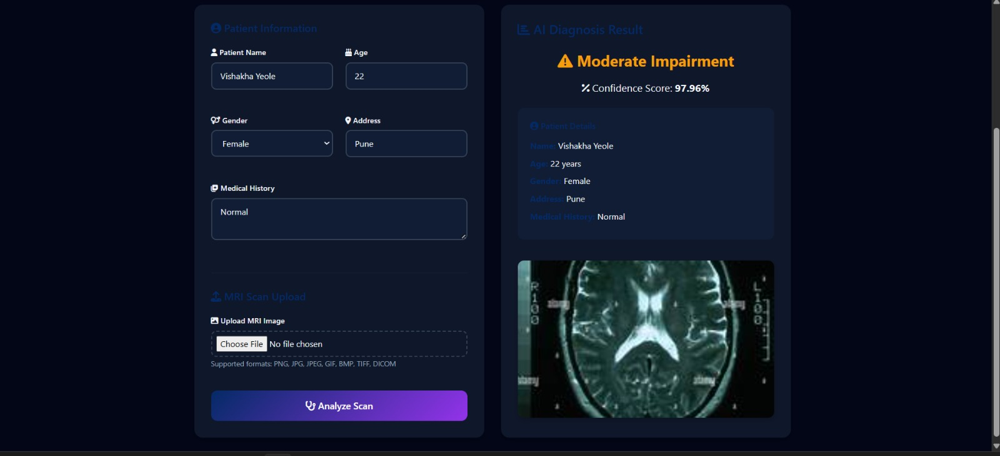
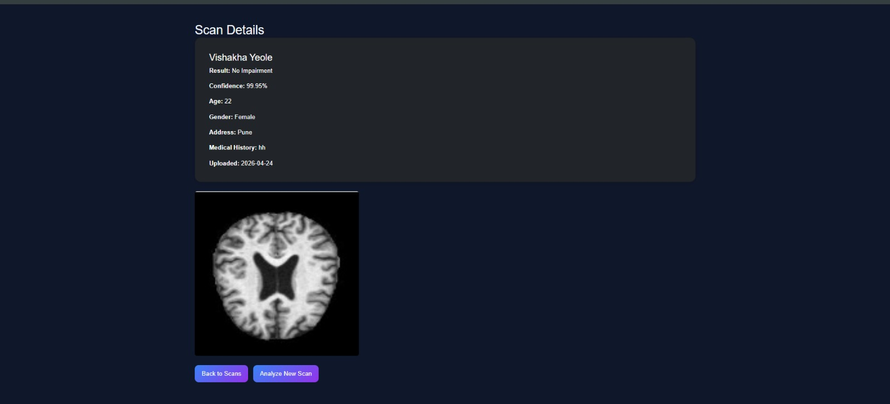
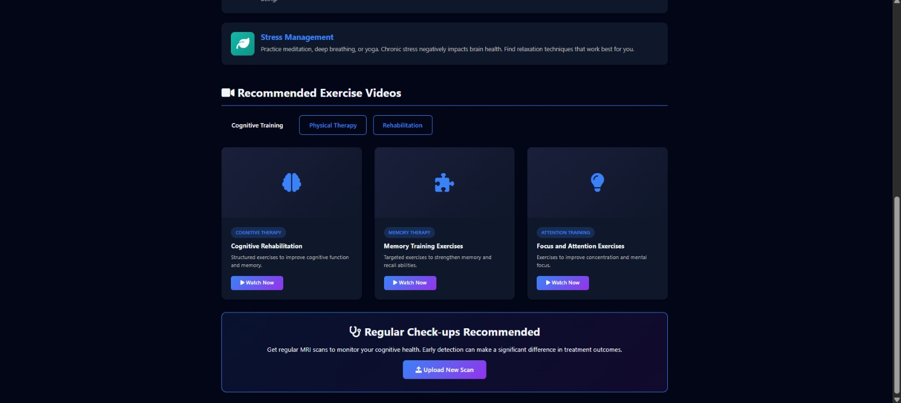
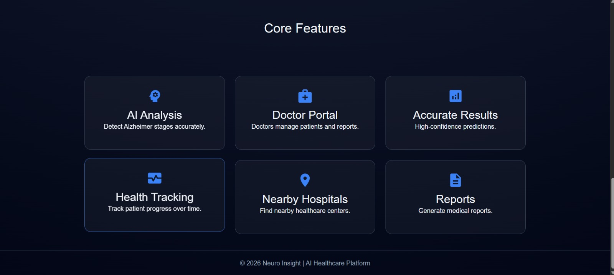

# 🧠 Alzheimer Detection System (Neuro Insight)

An AI-powered healthcare platform that detects Alzheimer’s disease using **MRI brain scans** and **Deep Learning models**, with an integrated **doctor-patient dashboard system**.

---

## 🚀 Project Overview

**Neuro Insight** is a smart AI-based platform designed for early detection of Alzheimer’s disease.  
It provides:

- 🧠 MRI-based AI diagnosis  
- 👩‍⚕️ Doctor + Patient ecosystem  
- 📊 Real-time reports & tracking  
- 📍 Nearby hospital suggestions  
- 📑 Medical report generation  

---

## 🛠️ Tech Stack

### 💻 AI & Backend
- Python  
- TensorFlow / Keras / PyTorch  
- OpenCV  
- NumPy, Pandas  
- Flask  

### 🌐 Frontend
- HTML  
- CSS  
- JavaScript  

### 📊 Visualization
- Matplotlib  
- Seaborn  

---

## 🧠 Features

- ✅ Alzheimer stage detection using MRI  
- ✅ Patient information management  
- ✅ Doctor dashboard with scan history  
- ✅ Real-time confidence score  
- ✅ Exercise & therapy recommendations  
- ✅ Secure login system (Doctor & User)  

---

## 🏗️ System Workflow

1. User logs into system  
2. Upload MRI scan  
3. Model processes image  
4. Predicts Alzheimer stage  
5. Displays result with confidence  
6. Stores data for doctor review  

---

## 📸 Screenshots

### 🔹 Home Page

---

### 🔹 Login Page

---

### 🔹 Dashboard

---

### 🔹 MRI Scan Upload & Result

---

### 🔹 Diagnosis Result

---

### 🔹 Recommendations & Therapy

---

### 🔹 Scan Details Page

---

## 📊 Model Details

- Model: Convolutional Neural Network (CNN)  
- Input: MRI Images  
- Output Classes:
  - Non-Demented  
  - Very Mild Demented  
  - Mild Demented  
  - Moderate Demented  

---

## 📁 Project Structure
